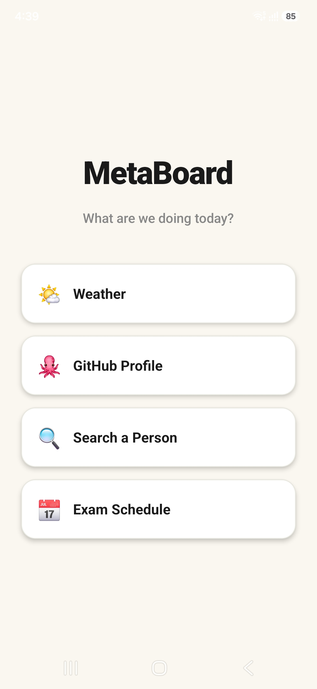
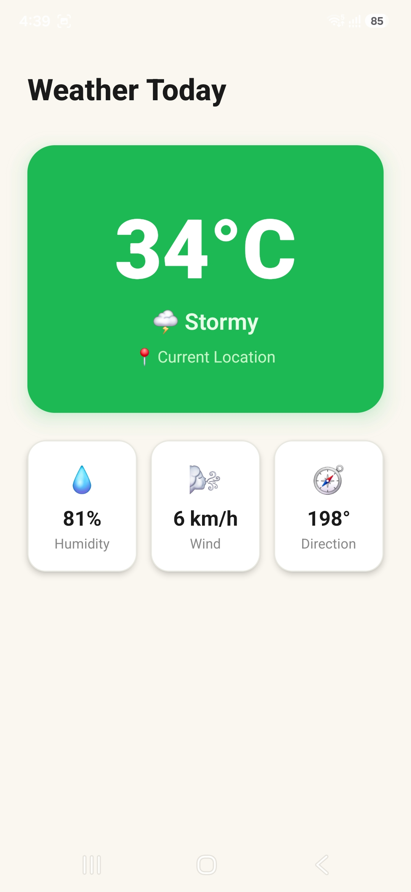
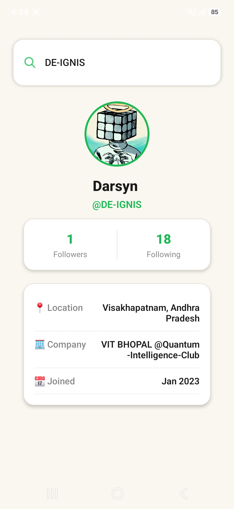
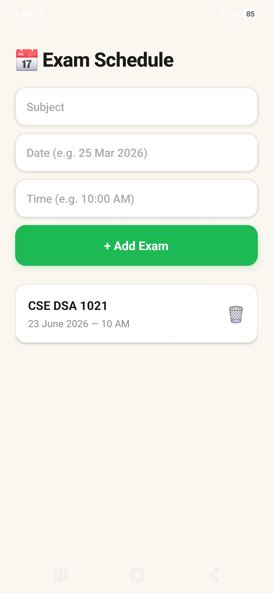

## Overview

A quick visual walkthrough of the application.

---

<table>
  <tr>
    <td align="center">
      <b>Home Screen</b> 
      
    </td>
    <td align="center">
      <b>Weather Feature</b> 
      
    </td>
  </tr>

  <tr>
    <td align="center">
      <b>GitHub Profile Fetch Feature</b> 
      
    </td>
    <td align="center">
      <b>Wikipedia Search Feature</b> 
      
    </td>
  </tr>

  <tr>
    <td align="center">
      <b>Exam Schedule Feature</b> 
      
    </td>
  </tr>
</table>

---
